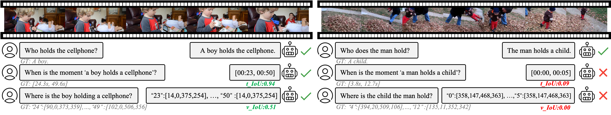
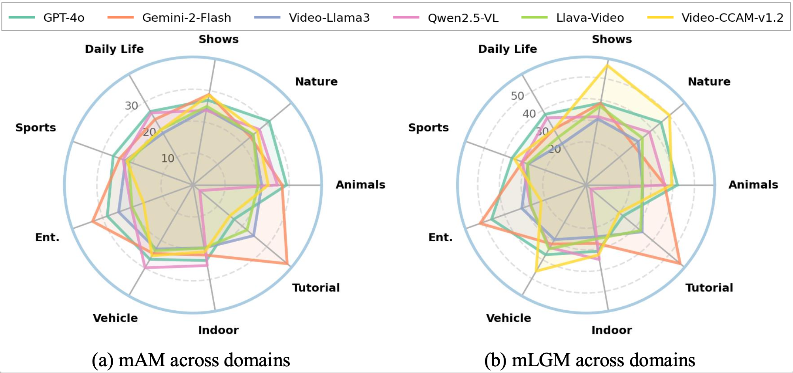

<!-- [](https://arxiv.org/abs/2311.99999) -->
[](https://arxiv.org/pdf/2503.11495)
[](https://huggingface.co/spaces/V-STaR-Bench/V-STaR-LeaderBoard)
[](https://huggingface.co/datasets/V-STaR-Bench/V-STaR)
[](https://v-star-bench.github.io/)
[](https://v-star-bench.github.io/)
[](https://hits.seeyoufarm.com)


This repository contains the implementation of the following paper and its related serial works in progress. We evaluate Video LLMs models!
> **V-STaR: Benchmarking Video-LLMs on Video Spatio-Temporal Reasoning**<br><p align="center">
    <a href="https://zxccade.github.io/">Zixu Cheng</a>,&nbsp;&nbsp;
    <a href="https://lwpyh.github.io/">Jian Hu<sup>+</sup></a>,&nbsp;&nbsp;
    <a href="https://sites.google.com/view/ziquanliu">Ziquan Liu</a>,&nbsp;&nbsp;
    <a href="https://chenyangsi.top/">Chenyang Si</a>,&nbsp;&nbsp;
    <a href="https://weivision.github.io/">Wei Li</a>,&nbsp;&nbsp;
    <a href="http://www.eecs.qmul.ac.uk/~sgg/">Shaogang Gong</a>
</p>


### Table of Contents
- [Updates](#updates)
- [Overview](#overview)
- [Evaluation Results](#evaluation_results)
- [Usage](#usage)
- [Citation and Acknowledgement](#citation_and_acknowledgement)

<a name="update"></a>
## :mega: Updates
- [03/2025] **MLLM reasoning collections released:** We’re excited to announce the release of the [Awesome-MLLM-Reasoning-Collection](https://github.com/lwpyh/Awesome-MLLM-Reasoning-Collection) repository! 🚀 This collection curates papers, code, datasets, benchmarks, and resources dedicated to MLLM reasoning, providing a valuable resource for researchers and practitioners in the field. Check it out and contribute! 🔍📚💡
- [03/2025] **Dataset released:** Our evaluation dataset is released.
- [03/2025] **Code and leaderboard released:** Our V-STAR benchmark is released.
<a name="overview"></a>
## :mega: Overview

<b>Overview of V-STaR.</b> Human processes video reasoning in a sequential spatio-temporal reasoning logic, we first identify the relevant frames (<b>"when"</b>) and then analyse the spatial relationships (<b>"where"</b>) between key objects, and finally leverage these relationships to draw inferences (<b>"what"</b>). However, can Video Large Language Models (Video-LLMs) also "<b>reason through a sequential spatio-temporal logic</b>" in videos? Existing Video-LLM benchmarks primarily focus on assessing object presence, neglecting relational reasoning. Consequently, it is difficult to measure whether a model truly comprehends object interactions (actions/events) in videos or merely relies on pre-trained "memory" of co-occurrences as biases in generating answers. In this work, we introduce a <b>V</b>ideo <b>S</b>patio-<b>T</b>empor<b>a</b>l <b>R</b>easoning (<b>V-STaR</b>) benchmark to address these shortcomings. The key idea is to decompose video understanding into a Reverse Spatio-Temporal Reasoning (RSTR) task that simultaneously evaluates what objects are present, when events occur, and where they are located while capturing the underlying Chain-of-thought (CoT) logic. To support this evaluation, we construct a dataset to elicit the spatial-temporal reasoning process of Video-LLMs. It contains coarse-to-fine CoT questions generated by a semi-automated GPT-4-powered pipeline, embedding explicit reasoning chains to mimic human cognition. Experiments from 14 Video-LLMs on our V-STaR reveal significant gaps between current Video-LLMs and the needs for robust and consistent spatio-temporal reasoning. 


<a name="evaluation_results"></a>
## :mortar_board: Evaluation Results

***See our leaderboard for the most updated ranking and numerical results (with models like GPT-4o, Gemini-2-flash and Qwen2.5-VL)***. [](https://v-star-bench-v-star-leaderboard.hf.space/)

We visualize the evaluation results of the 6 most recent top-performing Video-LLMs across 9 V-STaR domains.

We proposed to use Arithmetic Mean (AM) and modified logarithmic Geometric Mean (LGM) to measure the spatio-temporal reasoning capability of Video-LLMs. We calculate AM and LGM from the "Accuracy" of VQA, "m_tIoU" of Temporal grounding and "m_vIoU" of Spatial Grounding, and we get the mean AM (mAM) and mean LGM (mLGM) from the results of our proposed 2 RSTR question chains.

<p align="center">
  
</p>

## :trophy: Leaderboard

See numeric values at our [Leaderboard](https://huggingface.co/spaces/V-STaR-Bench/V-STaR-LeaderBoard) :1st_place_medal::2nd_place_medal::3rd_place_medal:

#### **How to join VBench Leaderboard?**

please contact us via email (jian.hu@qmul.ac.uk or zixu.cheng@qmul.ac.uk) to update your results.

#### Evaluation Criterion

To evaluate the open-ended *"what"* question, we use Qwen2.5-72B-Instruct to score answers from 0 to 4, denoting entirely incorrect, largely incorrect, largely correct, and entirely correct. Answers scoring above 2 are considered correct, allowing us to compute accuracy. 

For the *"when"* question, we follow the commonly used temporal grounding metrics, <R@n, tIoU=m>, which refers to the percentage of top-n prediction with temporal IoU score larger than m, and mean temporal IoU score (m\_tIoU). 

For the *"where"* question, we use the Average Precision score (AP@vIoU=m) and mean visual Intersection over the Union (m\_vIoU) of every annotated frame. We follow the proposed LGM and AM to measure a model's spatial-temporal reasoning ability. A higher LGM indicates a better overall spatio-temporal reasoning ability of the model, and a higher AM indicates a more average performance of the model on the three metrics.

<a name="usage"></a>
## Usage
##### Download V-STaR dataset on HuggingFace

```
git lfs install
git clone https://huggingface.co/datasets/V-STaR-Bench/V-STaR
```

##### Use V-STaR to evaluate Video-LLMs

We provide our inference_demo.py script to test Qwen2.5-VL-7B with:

```
python inference_demo.py 
```
You can try your Video-LLMs to infer on V-STaR based on the provided scripts to test the model's spatio-temporal reasoning ability.

To evaluate the results, update your result file path in the eval.py script and run:

```
python eval.py
```
Noted: You need at least 2 NVIDIA A100 80G GPUs to run Qwen-2.5-72B for evaluation.

## Submit to Leaderboard

please contact us via email (jian.hu@qmul.ac.uk or zixu.cheng@qmul.ac.uk) to update your results.

<a name="citation_and_acknowledgement"></a>

## :black_nib: Citation

   If you find our repo useful for your research, please consider citing our paper:

   ```bibtex
   @misc{cheng2025vstarbenchmarkingvideollmsvideo,
         title={V-STaR: Benchmarking Video-LLMs on Video Spatio-Temporal Reasoning}, 
         author={Zixu Cheng and Jian Hu and Ziquan Liu and Chenyang Si and Wei Li and Shaogang Gong},
         year={2025},
         eprint={2503.11495},
         archivePrefix={arXiv},
         primaryClass={cs.CV},
         url={https://arxiv.org/abs/2503.11495}, 
   }
   ```
